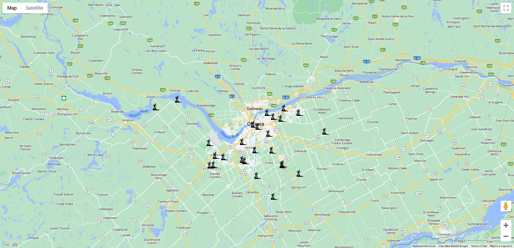

# React Google Map Demo Skateboard Parks Location

We have compiled a map of all skateparks in Ottawa. The user can click on any marker to locate the name and description of that particular park within an info window



## Stack
- React
- [react-google-maps](https://github.com/tomchentw/react-google-maps) library

to run the application follow below process.

## Configuration

copy ".env.example" file and rename it as ".env" and update google map api key in "REACT_APP_GOOGLE_KEY"

## Installation

```sh
npm install
npm run start
```